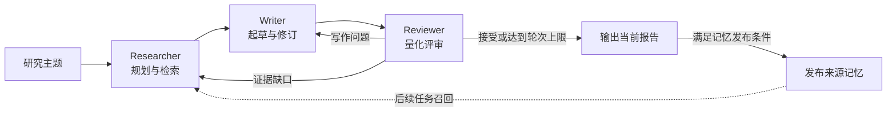

# ApexLogic

**刘宇翔个人项目（本科NJUST,硕士BJTU）**

**可恢复、可复用、可追踪的多智能体深度研究系统。**

输入研究主题，ApexLogic 自动完成问题拆解、多源检索、多跳补搜、报告写作与迭代评审。基于 LangGraph 编排 Researcher、Writer、Reviewer 三个 Agent，将检索证据、执行状态与跨任务记忆连接成完整研究流程。

**Python · LangGraph · Streamlit · BGE · SQLite / PostgreSQL + pgvector · Redis**

[核心能力](#核心能力) · [工作原理](#工作原理) · [快速开始](#快速开始) · [数据库与缓存部署](#数据库与缓存部署) · [配置](#配置) · [评测与开发](#评测与开发)

## 核心能力

| 能力 | 实现方式 |
| --- | --- |
| 多智能体研究闭环 | Researcher 检索、Writer 起草、Reviewer 评审；按反馈补充研究或定向修订 |
| 自适应检索 | Thompson Sampling 分配搜索结果配额，结合概念图扩展、AQD 子问题分解与 IRCoT 多跳补搜 |
| 证据筛选与引用 | BGE 向量召回与重排；普通检索来源和推理补搜来源分别保留引用链路 |
| 任务中断恢复 | LangGraph Checkpointer 持久化节点状态，保存配置快照、执行尝试与耗时，重启后继续任务 |
| 跨任务来源记忆 | 保存被接受报告引用的可追溯原文片段，通过 SQLite 或 PostgreSQL / pgvector 检索复用 |
| 记忆优先检索 | 逐子问题检查历史证据覆盖，只对满足复用条件的问题省去预计划搜索，保留缺口补搜 |
| 搜索与向量缓存 | 可选 Redis 精确缓存，配合 TTL、命名空间隔离、并发请求合并和故障旁路 |
| 全流程可观测 | Streamlit 展示逐题搜索资料、引用入选、评审路由、缓存统计及记忆发布尝试历史 |

适合需要跨多个来源建立结论、保留研究依据，以及持续复用已有资料的技术调研与多跳问答任务。

## 工作原理

### 研究、写作与评审



**Researcher** 负责查询规划、联网检索、记忆召回和资料筛选。**Writer** 将证据组织为报告，并依据反馈修订。**Reviewer** 结合支持与质疑视角、引用检查和结构化修订指令，决定结束、补搜或重写。

评审采用四维加权评分：事实准确性 35%、逻辑完整性 25%、信息覆盖广度 25%、结论可执行性 15%，默认通过阈值为 7.5 / 10。达到轮次上限也会结束任务，因此“执行完成”与“评审通过”是两个不同状态；评分是模型评估结果，不等同于外部事实认证。

### Researcher：按证据覆盖选择检索路径

记忆优先是否生效取决于证据能否覆盖子问题，而不只是数据库是否可连接。

| 路径 | 执行顺序 |
| --- | --- |
| 记忆复用生效 | 前置 AQD → 逐题召回与原文覆盖检查 → 未覆盖子问题多源检索 → IRCoT → BGE 筛选与重排 |
| 未满足复用条件 | 普通查询重写与广搜 → 概念图扩展 → AQD 子问题补搜 → IRCoT → BGE 筛选与重排 |

- **多源广搜**：整合 DuckDuckGo、arXiv、Tavily，使用 MAB（多臂老虎机）的 Thompson Sampling 自适应分配返回结果配额。该配额不是模型 Token 或 API 调用次数预算。
- **概念图扩展**：从已有资料构建概念共现图，通过 PageRank 选择扩展词，补充初始查询未覆盖的方向。
- **AQD**：将主题拆成可检索子问题。已有有效的前置计划会直接复用于后置补搜，避免再次调用模型分解；没有有效计划时再执行常规分解。`AQD_RESULTS_PER_SUBQ=3` 表示每题查询最多返回 3 条结果，不是生成 3 个查询变体。
- **IRCoT**：交替生成研究推理与缺口查询，沿多跳问题继续补搜；记忆复用生效时仍保留这一环节。
- **BGE**：默认先向量召回 Top-20，再重排至 Top-10。用于省去搜索的记忆证据受保留预算保护，避免跳过搜索后又在筛选中丢失依据。

记忆复用生效时，直接使用未覆盖子问题的查询，不再调用普通查询重写、图扩展和后置 AQD；超出多源广搜查询预算的子问题由 DDG 补搜。没有子问题满足免搜条件时，回到常规路径。

每个子问题都能查看计划查询、实际工具调用、资料链接与摘录、缓存标记，以及是否进入最终写作上下文。相同网址的不同内容分别匹配，同一资料被多个查询找到时保留其来源关系。

### Writer：多通道证据写作与反馈修订

Writer 接收检索资料、IRCoT 推理链及其补搜文档，将研究结果组织为带引用的结构化报告；后续轮次同时读取上一版草稿与 Reviewer 的修订指令。

- **多通道引用**：普通资料使用 `[S#]`，IRCoT 专属文档使用 `[R#]`，系统提供的推理链结论使用 `[推理链N]`。当前提示词将 IRCoT 的明确结论作为独立采信通道，不要求普通检索重复佐证。
- **反馈驱动修订**：根据 `must_fix`、信息缺口与评审反馈调整内容，提示词要求保留上一版中合格的段落、重点修复问题部分；实现上仍由模型生成完整新版草稿。
- **前提纠正与时间约束**：结合任务保存的研究时点处理时间表述。来源否定题目前提时，明确纠正前提并回答修正后的问题，区分确定结论与尚未知的信息。
- **输出与降级**：常规研究生成完整报告，评测模式采用专用作答提示词；模型不可用时生成带待补充标记的占位草稿，保留执行记录供后续排查。

### Reviewer：结构化评审与迭代路由

Reviewer 同时读取草稿、普通来源、IRCoT 文档和推理链，在一次结构化评审中组织 `supporter` 与 `skeptic` 两种视角，输出优点、事实与逻辑问题、信息缺口、引用检查和证据判断。

- **统一评分判定**：模型提供四维分数，代码按固定权重重新计算总分，并结合通过阈值与降级策略判定结果，不直接采用模型自报的总分或通过结论。
- **按问题类型路由**：未通过时，事实或覆盖严重不足、或评审建议补搜，会返回 Researcher；其余问题交给 Writer 修订。修订包包含 `must_fix`、关注方向和路由原因，供下一节点消费。
- **结论类型标记**：区分完整回答、纠正前提后的回答与明确披露缺口的有限结论。当前实现不再设置独立的关键证据否决门槛，提示词也允许系统提供的 IRCoT 明确结论独立支撑答案。
- **降级可追踪**：模型调用失败或输出需要兜底解析时，记录评审模式、降级状态与轮次；默认不允许降级评审放行。各轮分数、意见与路由随任务状态保存，便于回看迭代过程。

### 证据与跨任务记忆

记忆保存的是**可追溯的来源证据**。报告被评审接受后，系统从报告引用中提取能够匹配检索原文的片段，保存来源、摘录、时间、命名空间与向量，并记录发布和访问情况。召回的旧记忆不会被当作全新证据反复发布。

后续任务按子问题召回历史证据，并检查有效期、状态、模型版本与原文覆盖。仅有较高的语义相似度不足以省去搜索；部分覆盖、存在前置事实依赖、时效敏感问题或修订轮仍继续联网。用于免搜的证据还必须进入最终写作上下文，数量和字符数均受预算约束。

普通筛选资料使用 `S` 引用，IRCoT 补搜资料保留独立的 `R` 引用通道。“召回”“入选写作上下文”“被报告引用”分别统计，不能用召回条数代替实际复用效果。

### 状态持久化与 Redis 缓存

| 数据层 | SQLite 模式 | PostgreSQL + Redis 模式 | 职责 |
| --- | --- | --- | --- |
| 图执行状态 | `data/checkpoints.sqlite` | `apexlogic_checkpoints` schema | 保存 LangGraph checkpoint，恢复研究节点 |
| 任务与执行尝试 | `data/runs.sqlite` | `apexlogic` schema | 任务状态、原配置、尝试记录、执行耗时 |
| 来源记忆 | `data/memory.sqlite`，NumPy 向量检索 | `apexlogic` schema，pgvector 向量检索 | 长期保存证据、向量、关系、访问与发布记录 |
| 搜索与向量缓存 | 可选 Redis，也可关闭 | Redis | 在有效期内复用相同搜索请求与文本向量 |
| 页面历史与导出 | `appstats/`、`reports/` | 同左 | 历史展示快照和报告文件，不替代数据库 checkpoint |

SQLite 是默认后端；PostgreSQL 与 Redis 分别按需启用，二者不强制绑定。PostgreSQL 承担持久化存储，Redis 只保存可丢弃缓存。

- **恢复粒度**：已完成节点保留，进程中断后从未完成节点继续；节点内部尚未提交的搜索或模型调用可能重新执行。
- **配置一致性**：任务保存研究配置与研究时点快照，恢复时沿用原配置；新增策略不会自动套用到旧任务。
- **重复执行保护**：SQLite 使用文件锁，PostgreSQL 使用 advisory lock，阻止同一任务被多个进程同时执行。
- **精确缓存**：搜索缓存区分搜索源、查询与参数，向量缓存区分文本及模型配置；相同主题不保证命中，因为实际查询可能不同。
- **缓存失效与降级**：默认搜索 TTL 为 30 分钟、向量 TTL 为 7 天。时效敏感检索可绕过搜索缓存；Redis 不可用时旁路缓存继续调用原服务。

### 执行观察与记忆发布诊断

Streamlit 按节点更新执行结果，支持查看研究计划、逐题资料、IRCoT 补搜、报告草稿、四维评分与路由决策。完成页提供 Markdown 下载、可点击引用、缓存调用统计和记忆召回 / 入选 / 引用 / 发布情况；历史页面复用相同展示逻辑。

记忆发布独立于报告生成：发布失败不会抹掉已完成报告。重新打开已完成任务时，可补齐尚未生成的记忆向量，无需重新研究。

每次实际发布会写入 `memory_publication_attempts`，记录触发方式、执行阶段、已有与新增向量数量、失败证据 ID，以及经过白名单筛选的异常类型和状态码。重试成功仍保留先前失败记录，页面展示最近 50 次尝试。进程被强制退出时可能留下 `running`，它表示没有记录到结束，不能直接判定为成功或失败。该机制用于定位问题，并不保证外部服务故障自动消失。

## 快速开始

建议使用 Python 3.11+。默认 SQLite 模式无需安装数据库服务；模型、搜索和 BGE 接口按所启用功能配置。

### 1. 安装依赖

在项目根目录执行：

```bash
python -m venv .venv
```

激活虚拟环境：

```powershell
# Windows PowerShell
.\.venv\Scripts\Activate.ps1
```

```bash
# macOS / Linux
source .venv/bin/activate
```

```bash
python -m pip install -r requirements.txt
```

### 2. 配置服务

首次运行时，将 [`.env.example`](.env.example) 复制为 `.env`，已有配置则直接编辑，填写以下服务参数：

| 服务 | 配置 |
| --- | --- |
| 研究与写作模型 | `DEEPSEEK_API_KEY`、`DEEPSEEK_BASE_URL`、`DEEPSEEK_MODEL` |
| BGE 向量接口 | `BGE_EMBED_API_KEY`、`BGE_EMBED_BASE_URL`、`BGE_EMBED_MODEL` |
| BGE 重排接口 | `BGE_RERANK_API_KEY`、`BGE_RERANK_BASE_URL`、`BGE_RERANK_MODEL` |
| Tavily 搜索 | `TAVILY_API_KEY` |

示例使用 BGE-M3 与 BGE-Reranker-v2-M3，可替换为兼容的 embeddings / rerank 服务。DuckDuckGo、arXiv 无需在项目中配置 API Key。

**在复制后的 `.env` 中删除或注释 `HTTP_PROXY=http://`、`HTTPS_PROXY=http://` 占位项**；需要代理时填写实际有效地址。真实密钥只放在本地 `.env`，不提交到仓库。

### 3. 启动研究

```bash
# Web UI
streamlit run app.py

# 命令行
python main.py --topic "比较关系型数据库与向量数据库在智能体记忆中的适用场景"
```

Web UI 可设置研究主题、迭代上限、通过阈值和任务存储后端，也可查看已有任务并继续执行。

## 数据库与缓存部署

需要集中保存研究状态与记忆时，可启用 PostgreSQL / pgvector；需要复用搜索和向量请求时，可增加 Redis。仓库提供 Docker Compose 配置，应用仍在本地 Python 环境运行。

### PostgreSQL + pgvector

安装并启动 Docker，在虚拟环境中安装可选依赖：

```bash
python -m pip install -r requirements-postgres.txt
```

在 `.env` 中设置以下内容，密码占位值须替换，DSN 中的密码保持一致。示例使用本机 `5433` 端口，便于与已有的 `5432` 服务共存：

```dotenv
APEXLOGIC_POSTGRES_PORT=5433
APEXLOGIC_POSTGRES_PASSWORD=REPLACE_WITH_YOUR_PASSWORD
APEXLOGIC_POSTGRES_DSN="host=127.0.0.1 port=5433 dbname=apexlogic user=apexlogic password=REPLACE_WITH_YOUR_PASSWORD"
```

```bash
docker compose -f compose.postgres.yml up -d --wait
python -m scripts.postgres_admin init
python -m scripts.postgres_admin check
```

初始化完成后，将 `.env` 中的存储后端改为以下值并重启应用：

```dotenv
APEXLOGIC_STORAGE_BACKEND=postgres
```

`init` 创建或升级业务表、pgvector 扩展与 checkpoint 表；更新项目后也用此命令应用新增迁移。数据库客户端连接 `127.0.0.1:5433`、数据库 / 用户 `apexlogic`，选择 `apexlogic` 和 `apexlogic_checkpoints` 两个 schema 即可浏览业务与状态表。

切换后端不会自动搬迁旧任务。旧任务仍在原后端恢复；已有 SQLite 记忆可先预览，再显式导入：

```bash
python -m scripts.postgres_admin import-memory --source data/memory.sqlite
python -m scripts.postgres_admin import-memory --source data/memory.sqlite --apply
```

该命令导入来源记忆，不迁移 LangGraph checkpoint 或旧任务执行记录。

### Redis 缓存

```bash
python -m pip install -r requirements-redis.txt
```

将以下配置加入 `.env`，替换密码占位值：

```dotenv
APEXLOGIC_CACHE_ENABLED=1
APEXLOGIC_REDIS_HOST=127.0.0.1
APEXLOGIC_REDIS_PORT=6379
APEXLOGIC_REDIS_DB=0
APEXLOGIC_REDIS_PASSWORD=REPLACE_WITH_YOUR_REDIS_PASSWORD
APEXLOGIC_SEARCH_CACHE_TTL=1800
APEXLOGIC_EMBED_CACHE_TTL=604800
```

```bash
# 同时管理 PostgreSQL 与 Redis
docker compose -f compose.postgres.yml -f compose.redis.yml up -d --wait

# 检查 Redis 连接和一次缓存写入 / 命中，测试后清理测试键
python -m scripts.redis_admin
```

如果使用 SQLite，只需 `docker compose -f compose.redis.yml up -d --wait`。重启应用后，新执行的节点即可使用缓存。

Compose 中的 Redis 绑定本机地址，启用密码认证、256 MB 内存上限与 `allkeys-lru` 淘汰，不启用磁盘持久化。缓存丢失不会删除研究状态或来源记忆。

## 配置

下表列出常用配置。示例文件与未配置时的回退值不一致之处单独标注，其余为当前研究流程的默认值。

| 配置 | 默认或示例 | 作用 |
| --- | --- | --- |
| `MAX_REVISIONS` | `.env.example` 为 `4`；未配置回退 `3` | 评审迭代上限 |
| `REVIEWER_PASS_THRESHOLD` | `7.5` | 评审通过阈值 |
| `REVIEWER_ALLOW_DEGRADED_PASS` | `0` | 默认不因降级评审而自动放行 |
| `SEARCH_QUERY_BUDGET` | `3` | 广搜使用的查询条数预算 |
| `GRAPH_EXPAND_QUERIES` | `.env.example` 为 `4`；未配置回退 `2` | 图扩展查询数量 |
| `AQD_ENABLED` / `AQD_MAX_SUB_QUESTIONS` | `1` / `4` | 子问题分解开关与数量上限 |
| `AQD_RESULTS_PER_SUBQ` | `3` | 常规 AQD 每题补搜结果上限 |
| `ITERATIVE_RETRIEVAL_ENABLED` / `MAX_HOPS` | `1` / `4` | IRCoT 开关与推理跳数上限 |
| `BGE_RETRIEVER_TOP_K` / `BGE_RERANKER_TOP_K` | `20` / `10` | 向量召回与重排候选数 |
| `MEMORY_ENABLED` | `1` | 新任务启用来源记忆 |
| `MEMORY_FIRST_MODE` | `reuse` | 新任务记忆优先策略：`off`、`observe`、`reuse` |
| `MEMORY_NAMESPACE` | `workspace/default` | 记忆与缓存的逻辑命名空间 |
| `MEMORY_TOP_K` / `MEMORY_MIN_SCORE` | `5` / `0.65` | 记忆召回条数与相似度阈值 |
| `MEMORY_TTL_DAYS` / `MEMORY_CHAR_BUDGET` | `30` / `3000` | 记忆有效期与摘录字符预算 |
| `APEXLOGIC_STORAGE_BACKEND` | `sqlite` | 持久化后端：`sqlite` / `postgres` |
| `APEXLOGIC_CACHE_ENABLED` | `0` | 可选 Redis 缓存开关 |
| `APEXLOGIC_CACHE_FORCE_REFRESH` | `0` | 设为 `1` 绕过搜索缓存和记忆优先减搜 |

`MEMORY_FIRST_MODE` 和 Redis 配置可手动加入 `.env`。`observe` 执行记忆覆盖评估但不减少预计划搜索，适合与 `reuse` 对照；`off` 关闭记忆优先调度，不等同于关闭整个记忆模块。旧任务缺少该策略快照时按 `off` 处理。

时效判断使用关键词规则；存在隐含时效要求时可强制刷新。强制刷新针对搜索与记忆减搜，文本向量仍可复用缓存。

## 任务管理与报告导出

```bash
python main.py --list-runs
python main.py --status RUN_ID
python main.py --resume RUN_ID

# 显式选择原任务后端
python main.py --resume RUN_ID --storage-backend sqlite

# 从已完成任务导出，不重新调用模型
python export_report.py --run-id RUN_ID --output-mode both

# 新建研究并导出，会调用搜索和模型服务
python export_report.py --topic "多智能体系统中的反思机制" --output-mode both
```

将 `RUN_ID` 替换为实际任务 ID。`main.py` 支持 `user` / `debug` 输出；`export_report.py` 支持 `user` / `debug` / `both` / `user_only`，用于生成阅读报告或包含执行过程的调试材料。

断点恢复可通过运行中终止 Streamlit 进程后重启验证：使用同一后端打开原任务，检查已完成节点是否保留、未完成节点是否继续，以及执行尝试是否新增。累计耗时只包含已记录的部分，强制退出前尚未保存的时长不计入。

## 评测与开发

### 多跳问答评测

支持 HotpotQA、Bamboogle，以及 Exact Match / LLM 语义判定：

```bash
python eval_runner.py --dataset hotpotqa --difficulty hard --limit 50 --scorer llm --concurrency 4
python eval_runner.py --dataset bamboogle --limit 10 --scorer em
```

也可直接调用商业模型作为基线：

```bash
python eval_baselines.py --provider qwen --dataset hotpotqa --level hard --limit 50 --scorer llm
python eval_baselines.py --provider doubao --dataset hotpotqa --level hard --limit 50 --scorer llm
```

基线分别需要 `QWEN_API_KEY` 或 `DOUBAO_API_KEY` + `DOUBAO_ENDPOINT_ID`。评测脚本独立于 Streamlit，结果默认写入 `tests/`。评测并发参数用于批量任务，不表示单个 Researcher 已实现分布式并行检索。

### 回归测试与效果验证

```bash
python -m pytest -q
```

测试覆盖缓存、记忆优先决策、查询规划复用、逐题资料追踪等行为；真实 PostgreSQL / Redis 集成测试按各测试文件的说明显式启用，使用隔离测试资源。

验证记忆与缓存收益时，建议对同类新任务比较 `off`、`observe`、`reuse`，同时记录报告质量、实际外部调用数、缓存命中、记忆入选 / 引用和总耗时。记忆覆盖判断本身会增加模型调用，单次命中或一对重复任务不足以证明稳定提速。

### 项目结构

```text
ApexLogic/
├── agents/                 # Researcher、Writer、Reviewer 与证据处理
├── core/                   # LangGraph、任务执行、持久化、配置、缓存
├── memory/                 # 来源记忆、逐题覆盖、发布与诊断
├── optim/                  # MAB、图扩展、AQD、IRCoT、检索追踪
├── bge/                    # 向量接口、召回与重排
├── tools/                  # Web 与 arXiv 搜索工具
├── prompts/                # Agent 提示词
├── scripts/                # PostgreSQL 初始化、迁移与 Redis 检查
├── evals/                  # 数据集、评分和结果分析
├── tests/                  # 回归与集成测试
├── docs/                   # 模块设计与验收说明
├── app.py                  # Streamlit Web UI
├── main.py                 # 持久化研究 CLI
├── export_report.py        # 报告导出
├── eval_runner.py          # ApexLogic 批量评测
├── eval_baselines.py       # 商业模型基线
├── compose.postgres.yml    # PostgreSQL + pgvector
└── compose.redis.yml       # Redis 缓存
```

进一步阅读：[记忆优先检索](docs/memory-first.md) · [查询规划与逐题资料追踪](docs/retrieval-planning-audit.md) · [Redis 缓存](docs/redis-cache.md) · [记忆发布诊断](docs/memory-publication-diagnostics.md)
