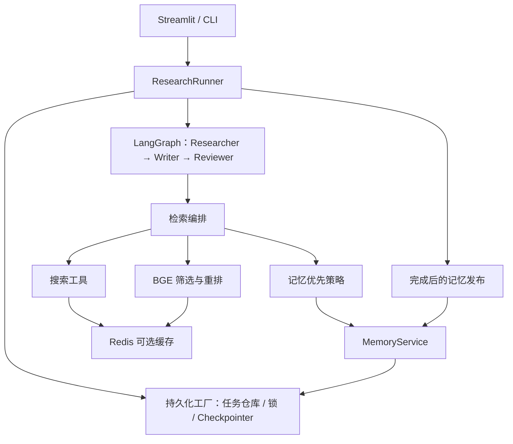

# 架构与模块契约

[返回索引](index.md)

## 职责与边界

本文解释模块连接与状态归属，不展开搜索算法、数据库安装或恢复步骤。ApexLogic 的生产入口是 ResearchRunner，研究流程是三个 LangGraph 节点组成的循环图；记忆发布在图完成后执行，不是第四个研究节点。

## 模块依赖

Redis 只加速指定请求；未启用 Redis 时研究和持久化仍能工作。PostgreSQL 也不是启用记忆优先的必要条件，SQLite 支持相同业务策略。

## 数据契约

[ResearchState](../../core/state.py) 是节点共享状态，节点返回字典补丁。现有节点自己构造累计列表，Runner 用 state.update 合并，不应把它误解为框架会自动去重或追加所有字段。

| 状态组 | 核心字段 | 主要生产者 / 消费者 |
| --- | --- | --- |
| 身份与配置 | run_id、thread_id、run_config、schema_version、workflow_version | Runner → 各节点 |
| 搜索计划 | planned_search_queries、search_queries、query_plan | Researcher → UI / 调试 |
| 写作证据 | retrieved_context、reasoning_contexts、reasoning_enabled | Researcher → Writer / Reviewer / 发布 |
| 推理与筛选 | reasoning_chains、reasoning_summary、source_quality_summary | Researcher → 下游与展示 |
| 草稿与反馈 | draft、critique_feedback、revision_directives | Writer ↔ Reviewer |
| 路由与结束 | revision_step、is_satisfactory、answer_status、next_route | Reviewer → 图与 Runner |
| 记忆使用 | memory_stats、memory_first、memory_used_ids | 检索 / Writer → 发布与展示 |
| 观察记录 | execution_trace、iteration_history、cache_stats | 节点 → checkpoint / UI |

memory_publication 和发布尝试历史由 Runner 在图外查询或发布后叠加到返回状态。不要假设页面上出现的所有字段都已写回图的最终 checkpoint。

## 一次任务的数据流

1. UI / CLI 请求 Runner 创建任务，生成身份、配置快照与配置哈希。
2. Runner 获得任务锁，选择对应后端的 Checkpointer，开始或恢复图。
3. Researcher 输出证据与检索审计；Writer 输出草稿；Reviewer 输出评分、标签和下一跳。
4. 已完成节点由 Checkpointer 持久化；任务仓库记录运行状态和执行尝试。
5. 图结束后，Runner 标记任务完成，再尝试记忆发布。
6. UI 展示返回状态并保存页面历史，导出模块生成 Markdown 文件。

## 重要边界

- 多 Agent 是职责分工与图路由，不代表当前单任务检索已实现异步 DAG 或分布式调度。
- “任务完成”“评审接受”“记忆发布完成”“报告导出成功”是不同结果。
- checkpoint 是恢复依据，appstats JSON 是展示快照，Redis 是缓存，不能互相替代。
- memory namespace 是逻辑隔离字段，不能据此宣称已实现用户认证或多租户授权。
- 恢复后允许重跑未提交节点，不承诺外部 API 调用恰好一次。

## 源码与后续阅读

入口：[core/runner.py](../../core/runner.py)、[core/graph.py](../../core/graph.py)、[core/storage.py](../../core/storage.py)。

生命周期见[执行与恢复](execution.md)，各模块职责和阅读路径见[索引](index.md)。
