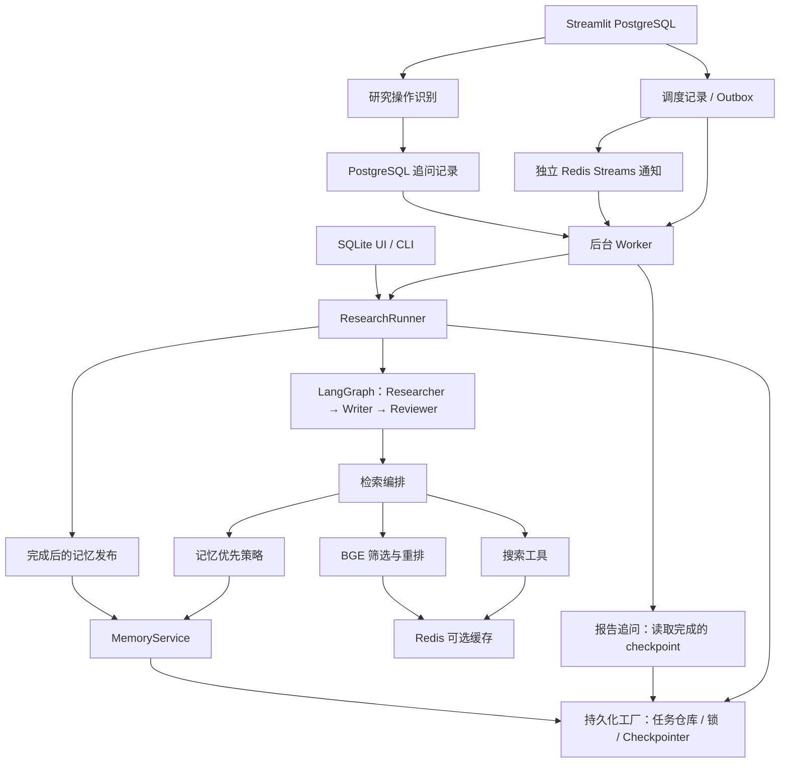

# 架构与模块契约

[返回索引](index.md)

## 职责与边界

本文解释模块连接与状态归属，不展开搜索算法、数据库安装或恢复步骤。研究执行入口是 ResearchRunner；PostgreSQL 模式下由后台 Worker 调用，SQLite 页面和 CLI 可直接调用。研究流程是三个 LangGraph 节点组成的循环图；记忆发布在图完成后执行，不是第四个研究节点。

## 模块依赖

图中的缓存 Redis 只加速指定请求，可关闭；独立的队列 Redis 用于后台 Worker 通知，Worker 启动时需要它。PostgreSQL 保存权威调度状态，运行中的 Worker 在队列 Redis 暂时不可用时仍可扫描数据库。PostgreSQL 不是启用记忆优先的必要条件，SQLite 支持相同业务策略。

## 数据契约

[ResearchState](../../core/state.py) 是节点共享状态，节点返回字典补丁。现有节点自己构造累计列表，Runner 用 state.update 合并，不应把它误解为框架会自动去重或追加所有字段。

| 状态组 | 核心字段 | 主要生产者 / 消费者 |
| --- | --- | --- |
| 身份与配置 | run_id、thread_id、run_config、schema_version、workflow_version | Runner → 各节点 |
| 搜索计划 | planned_search_queries、search_queries、query_plan | Researcher → UI / 调试 |
| 写作证据 | retrieved_context、reasoning_contexts、reasoning_enabled | Researcher → Writer / Reviewer / 发布 |
| 推理与筛选 | reasoning_chains、reasoning_summary、source_quality_summary | Researcher → 下游与展示 |
| 草稿与反馈 | draft、critique_feedback、revision_directives | Writer ↔ Reviewer |
| 路由与结束 | revision_step、is_satisfactory、answer_status、next_route | Reviewer → 图与 Runner |
| 记忆使用 | memory_stats、memory_first、memory_used_ids | 检索 / Writer → 发布与展示 |
| 观察记录 | execution_trace、iteration_history、cache_stats | 节点 → checkpoint / UI |

memory_publication 和发布尝试历史由 Runner 在图外查询或发布后叠加到返回状态。不要假设页面上出现的所有字段都已写回图的最终 checkpoint。

## 一次任务的数据流

1. SQLite UI / CLI 请求 Runner 创建任务；PostgreSQL UI 通过调度器在同一事务创建任务和 outbox。两者均生成身份、配置快照与配置哈希。
2. PostgreSQL Worker 领取租约并调用 Runner；Runner 获得任务锁，选择对应后端的 Checkpointer，开始或恢复图。
3. Researcher 输出证据与检索审计；Writer 输出草稿；Reviewer 输出评分、标签和下一跳。
4. 已完成节点由 Checkpointer 持久化；任务仓库记录运行状态和执行尝试。
5. 图结束后，Runner 标记任务完成，再尝试记忆发布。
6. 直接执行的 UI 与后台 Worker 使用相同格式写入 appstats 历史快照；完成任务的 UI 可从 checkpoint 重建缺失的快照。报告导出模块单独生成 Markdown 文件。

## 重要边界

- 多 Agent 是职责分工与图路由，不代表当前单任务检索已实现异步 DAG 或分布式调度。
- “任务完成”“评审接受”“记忆发布完成”“报告导出成功”是不同结果。
- checkpoint 是恢复依据，appstats JSON 是可重建的展示快照；缓存 Redis 与独立队列 Redis 也不能替代 PostgreSQL 状态。
- 报告追问有独立的 PostgreSQL 记录和 Worker 租约，只读取原任务 checkpoint，不作为 Researcher / Writer / Reviewer 的新节点。
- memory namespace 是逻辑隔离字段，不能据此宣称已实现用户认证或多租户授权。
- 恢复后允许重跑未提交节点，不承诺外部 API 调用恰好一次。

## 源码与后续阅读

入口：[core/runner.py](../../core/runner.py)、[core/graph.py](../../core/graph.py)、[core/storage.py](../../core/storage.py)。

生命周期见[执行与恢复](execution.md)，各模块职责和阅读路径见[索引](index.md)。
